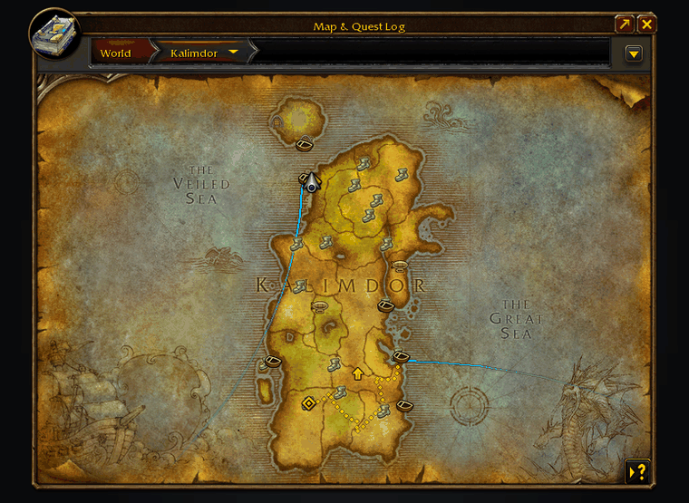
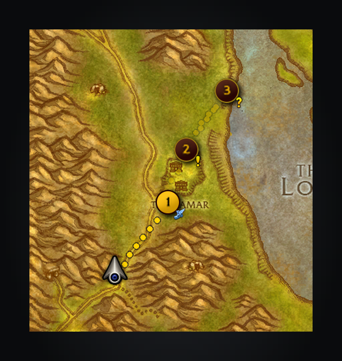
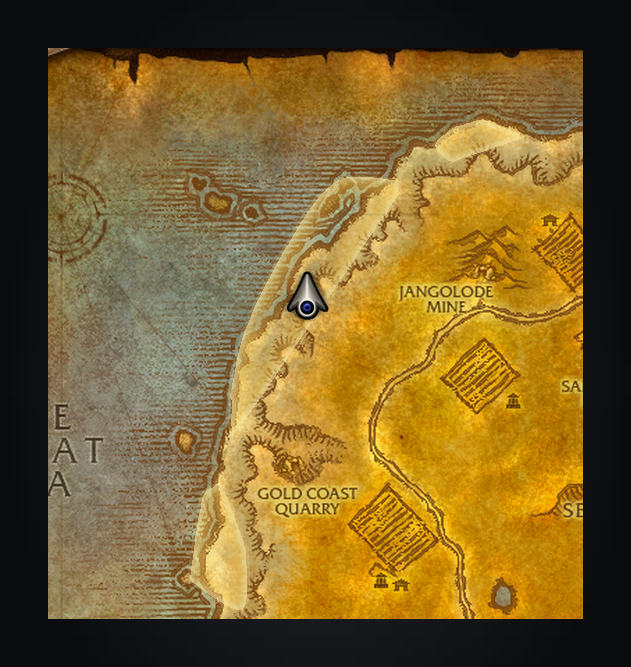
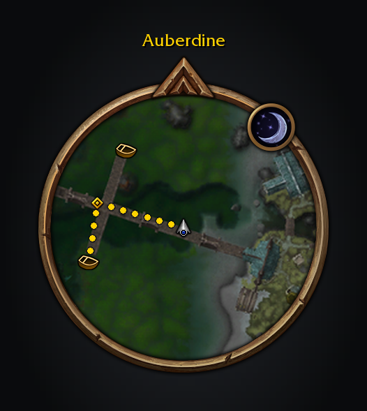
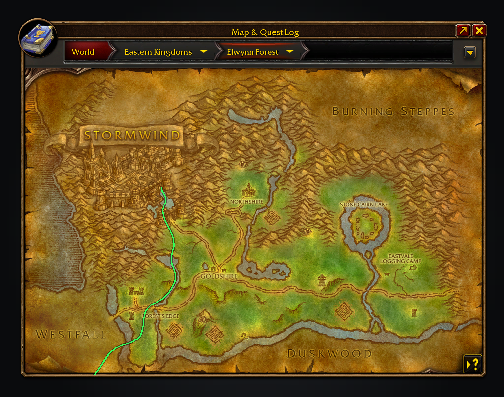
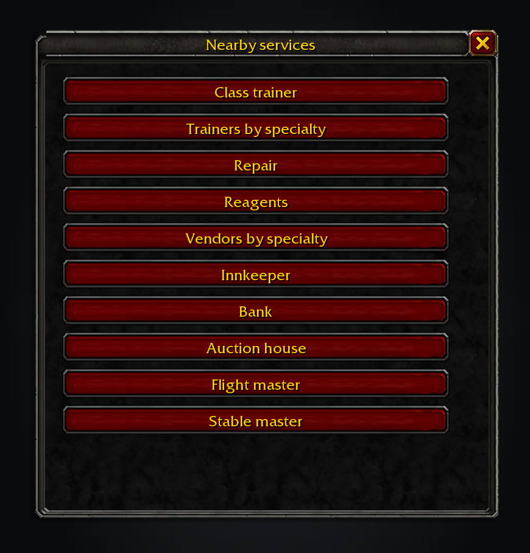
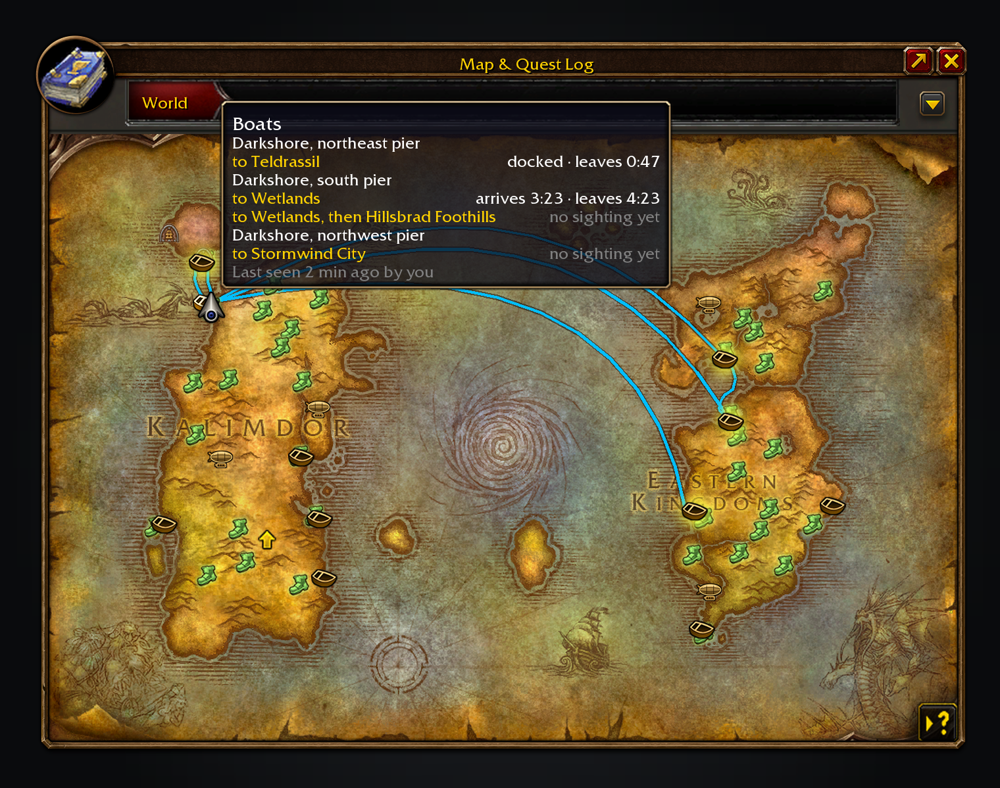
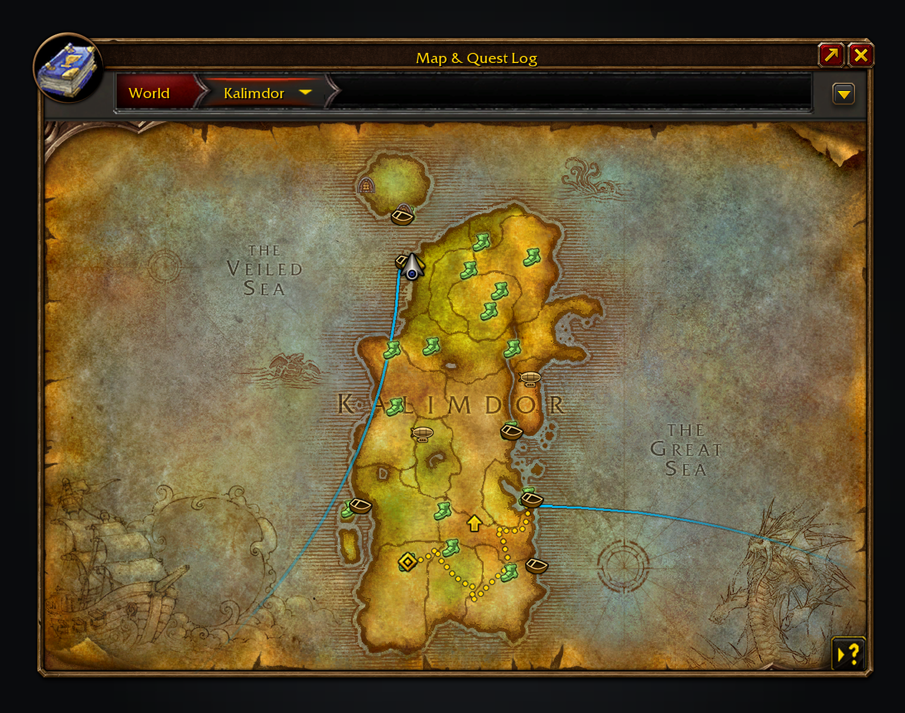
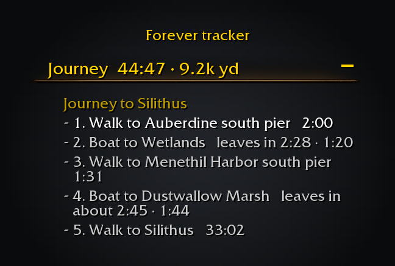

<p align="center"></p>

<h1 align="center">Shortest Path Forever</h1>

<p align="center">
The fastest way anywhere in WoW: Forever, on foot, by air, by sea and through portals.<br>
<a href="https://github.com/cjber/shortest-path-forever/actions/workflows/ci.yml"></a>
<a href="https://github.com/cjber/shortest-path-forever/releases/latest"></a>
</p>

Shift-click the world map or minimap, or pick a quest, and it plans the route: walking paths round walls and hills,
the flight points you know, boats and zeppelins with their live departure times, lifts, the tram and portals. Then it
walks you there with the game's own navigation marker. Walking maps cover Eastern Kingdoms, Kalimdor and Zephras Isle;
they are compressed inside the addon and decoded as a route reaches them.
The route, pins and tracker use the game's own art, so it looks like it came with the game.



Planning a journey from the map: the route settles, the next boat counts down in the tracker and the compass turns
with you.

## Features

Each feature has more detail in [docs/features.md](docs/features.md).

- **Journey planner.** Shift-click the map or minimap, or choose *Plan journey* on a quest, for the fastest way there
  on foot, by flight, boat, zeppelin, lift, tram, portal or teleport. The route is drawn on both maps, its steps sit in
  the objective tracker, and it replans as you move.
  
- **Journeys from your guides.** With TomTom not installed, Questie and other guides that set a TomTom waypoint
  start a journey here instead, carrying the guide's title. *Let guides set TomTom waypoints* in `/path` turns it off.
  
- **Quest areas the game draws itself.** A stop that marks a quest area is drawn by the client while you are
  inside it: the game's own area on the minimap turns gold and the world map outlines it in the route's yellow, in
  place of a pin and a line of ours.
  
- **Guide.** The game's own waypoint marker leads you to where each step ends, the next boat, lift, flight master or
  your destination, and hands your tracked quest back when you arrive. Turn off *Mark only where steps end*
  in `/path` and it leads you turn by turn instead, round walls. Click the tracker header to turn Guide off.
  
- **Flight map guidance.** At the flight master, your journey's next flight is drawn with the game's own route
  lines, and its final destination lights up. Hovering another flight point shows its route as usual; moving away
  brings your journey's route back. Turn it off in `/path`. Flight lines on the world map and minimap curve smoothly.

  
- **Compass.** A slim strip at the top of the screen marks Guide's next two turns, the next stop and your
  destination, in the game's own ticks, gold letters and waypoint pin. *Show the compass* in
  `/path` turns it off; *Move the compass* lets you drag it anywhere.
  
- **A route button.** A round button on the minimap in the game's own minimap button art starts and stops the
  route in one click and turns gold while a route is on. Right-click opens `/path`.
- **Nearby services.** Middle-click the route button or use `/spfnear` to open the service menu on the world map. Find a class or profession trainer, repairs, reagents, vendors, an inn, bank, auction house, flight master or stable. Choose trainers and vendors by specialty. Uses installed QuestieDB and Tweaks Forever for your class trainers.
  
- **Back to your corpse.** Once you release as a ghost, a red dotted path in the colour of your corpse's tombstone
  leads back to it on both maps, with Guide and the time in the tracker. Your journey waits and comes back when you
  are alive again. *Show the way to your corpse* in `/path` turns it off.
- **Docks on the world map.** Piers and zeppelin towers get the stock ferry icon and a matching zeppelin. Hover one for
  where each boat goes next and when; the docks it sails to light up and its routes are drawn. Click one to open the
  map at the other end, where a ping marks the dock; one with several destinations asks which.
  
- **Lifts, the Deeprun Tram and portals** count down like the boats; portals are marked with where they go, and
  clicking a station or portal opens the map where it comes out. Docks, lifts, stations and portals show on the
  minimap too, with the same tooltips; *Transport* in the minimap's tracking menu turns them off there.
- **Next departures.** At a dock, lift or tram station, a tracker section above your quests counts down to every
  arrival and departure; on board, it shows the next call.
- **Arrival alerts.** A raid-warning banner, the ship's own bell (the horn for a zeppelin, the tram pulling in
  for the tram) and a flashing taskbar icon half a minute before your boat arrives, for anyone waiting AFK.
- **Times from real rides, shared.** One ride, yours or another player's, times a boat for hours, and a flight is
  timed from take-off to landing so the next journey plans it from your own ride. Sightings pass quietly over guild,
  party and yell at the docks; turn sharing off in the settings.



A longer trip: Auberdine to Menethil, then Theramore, then Silithus.

## Install

Install it from [CurseForge](https://www.curseforge.com/wow/addons/shortest-path-forever) or
[Wago Addons](https://addons.wago.io/addons/shortest-path-forever), or download the zip from
[Releases](https://github.com/cjber/shortest-path-forever/releases). To install the zip by hand, extract it into
`_classic_beta_/Interface/AddOns/` so you end up with `AddOns/ShortestPathForever/ShortestPathForever.toc`.

## Usage

Open a flight master’s map once after installing to sync the flight points you already know. Opposing-faction boat and zeppelin routes are off by default; you can opt in through settings.

| Command | What it does |
|---|---|
| `/path` | Open the settings (also in Settings → AddOns, or from the addon compartment on the minimap) |
| `/path perf` | Print this addon's CPU averages and peaks from the client's profiler, and its memory after a full collection, terrain included |
| `/path debug` | Keep a trace of your position and ride matching, for reporting a ride that did not sync |
| `/spfnear` | Open the nearby services menu on the world map; add `class`, `trainer`, `repair`, `reagents`, `vendor`, `innkeeper`, `bank`, `auction`, `flight` or `stable` to route to the nearest one |

Every feature has its own switch in the settings; the world map's filter menu and the minimap's tracking menu hide
each kind of mark. Searches and tracker updates wait until combat ends.
In Guidance, **Minimum Hearthstone saving** lets you keep your Hearthstone for bigger time savings.
It defaults to zero; class teleports still count as alternatives.

It's in English for now. Translations are welcome as a pull request, or pasted into an issue, on
[GitHub](https://github.com/cjber/shortest-path-forever/tree/main/Locales).

## How the times work

Routes, docks and each boat's timetable are generated by `tools/gen_routes.py` from the client's
`TaxiPathNode` table: the transport paths with stops, timed with the server's transport model (CMaNGOS
`TransportMgr`). The eight classic routes match their sniffed loop times to within 0.07%, and those eight routes
are stretched onto their measured periods; the rest use the mean correction. What the data cannot know is
where in its loop a boat is right now; that is what a ride (yours or another player's) supplies.

Lifts and the tram come from the client's `TransportAnimation` table placed at their CMaNGOS spawns, flight
paths from `TaxiNodes`/`TaxiPath` (with InFlight's recorded flight times where it has them), and portals
from CMaNGOS's teleport triggers; `tools/gen_transit.py` builds all three. The planner uses discovered flight
points, and may walk to an undiscovered flight master when learning it makes the journey faster.


The heading moves the whole column; your quests keep their own position.

Turn off **Attach to quest tracker** in Settings to drag the shared Forever column. Its position survives `/reload`; turn the setting back on to attach it above your quests.

## Works alongside

Other addons can plan and guide journeys through `ShortestPathForever.API`: travel-time estimates, and routes of
up to 64 stops that wear the game's own quest, flight master or boat marks. While TomTom is not installed, the
addon answers TomTom's waypoint calls, and a held stop can name the quest area it stands for. [docs/api.md](docs/api.md)
has the calls and what they return.

Used by my other Forever addons when both are installed:
[Adventure Guide Forever](https://www.curseforge.com/wow/addons/adventure-guide-forever), [SkillUp Forever](https://www.curseforge.com/wow/addons/skillup-forever), [Legacy Forever](https://www.curseforge.com/wow/addons/legacy-forever) and [Tweaks Forever](https://www.curseforge.com/wow/addons/tweaks-forever).

## Development

Developed with AI assistance. Changes are reviewed and checked with automated tests, linting, type checks and performance budgets.

```sh
tools/typecheck.sh                  # strict LuaLS + multi-value lint (requires LuaLS 3.19.1, git, Python 3)
python3 tools/refresh_pins.py        # pin the newest client build and flight times (a daily workflow does this)
python3 tools/gen_routes.py          # regenerate Data/Routes.lua for the pinned build
python3 tools/gen_transit.py         # regenerate Data/Transports.lua, Data/Taxi.lua, Data/Portals.lua and Data/Teleports.lua
tools/draw_zeppelin.py               # redraw media/zeppelin.tga (the game has no zeppelin map icon)
(for s in tests/*_spec.lua; do luajit "$s" || exit 1; done)  # the headless specs
luajit -joff tests/journey_bench.lua  # searches, rounds and frames at the 3 ms budget
luajit tests/walk_sim.lua            # follow four real routes; assert zero route flips
```

CI runs luacheck, the specs, LuaLS, StyLua, ruff, shellcheck, shfmt, actionlint, zizmor, gitleaks and sift on pull
requests and pushes to main. The benches and their budgets are in [tests/journey_performance.md](tests/journey_performance.md)
and [tests/search_performance.md](tests/search_performance.md); [type-checking notes](types/README.md) cover the
pinned WoW API annotations, local declarations and intentional multi-value calls.

**Contributing:** [CONTRIBUTING.md](https://github.com/cjber/.github/blob/main/CONTRIBUTING.md), this repository's
[AGENTS.md](AGENTS.md), and [SECURITY.md](https://github.com/cjber/.github/blob/main/SECURITY.md) for private
security reports.

**Releasing:** move the `[Unreleased]` notes in `CHANGELOG.md` under `## [X.Y.Z] - YYYY-MM-DD`, set
`ns.WHATS_NEW` in `UI/WhatsNew.lua` to that entry's headline in one sentence, then
`git tag -s vX.Y.Z && git push --tags`. The [BigWigs packager](https://github.com/BigWigsMods/packager) builds the zip
and uploads it to GitHub Releases, CurseForge and Wago.

## Licence

GPL-3.0-or-later. Routes, lifts, the tram and flight paths come from the game's data via
[wago.tools](https://wago.tools); transport timing and portals from [CMaNGOS](https://github.com/cmangos); recorded
flight times from [InFlight](https://github.com/LudiusMaximus/InFlight) (MIT).

Made by Cillian Berragan · [cillian.dev](https://cillian.dev) · [GitHub](https://github.com/cjber) · [Twitter](https://twitter.com/cjberragan)
