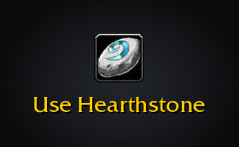

<h1 align="center">Shortest Path Forever</h1>

Plan journeys in WoW: Forever, on foot, by air, by sea and through portals. 

Shift-click the world map or minimap, or choose a quest, to plan a journey. Shortest Path Forever gives directions in the objective tracker and on both maps.

Planning a journey from the map: the route settles, the next boat counts down in the tracker and the compass turns
with you.

## Features

- **Plan a journey.** Shift-click the world map or minimap, or choose *Plan journey* on a quest. Routes combine walking, flights, boats, zeppelins, lifts, the tram, portals and teleports, and replan as you move.
  
  The tracker shows each step, with time and distance remaining.
- **Follow RestedXP.** Journeys follow its current target by default, without TomTom or a bridge addon. In Guidance settings, *Resume guide* returns to RestedXP after another journey. Adventure Guide handles navigation when its RestedXP display is enabled.
- **Use another guide's waypoints.** With TomTom absent, guides that call its waypoint API can start journeys here. *Let guides set TomTom waypoints* controls this.
  
  The current stop lights up like a tracked quest.
- **Choose your guidance.** Keep the route on both maps while hiding the Journey tracker or direction arrow. Show distances in yards or metres. Click the current step to complete it manually; skipping a Hearthstone leaves it out for that journey.
  
  Breadcrumbs show the walking route; the waypoint leads to the next step.
- **See flights and departures.** Flight maps highlight your next flight. Dock tooltips show destinations and departure times; nearby services count down in the tracker. Ride times improve estimates and can be shared with your guild, party and nearby players.
  
  Flight lines follow the route between flight points.
- **Find nearby services.** The map and minimap tracking menus offer trainers, repairs, reagents, vendors, inns, banks, auction houses, flight masters and stables. Requires installed QuestieDB; class trainers also use Tweaks Forever.
  
  Choose a service to plan the trip there.
- **Travel prompts and alerts.** Hearthstone and teleport steps show the item or spell to use. A banner, transport sound and taskbar flash warn before your boat arrives.
  
  The prompt clears as the journey continues.
- **Compass and corpse routes.** The compass marks turns, stops and your destination. As a ghost, a red route leads to your body; your journey resumes when you are alive.
  
  The strip can be moved and resized separately from the tracker.
- **Quest areas.** Inside a quest's area, the client draws it in gold instead of a stop pin and line.
  
  The highlighted area is the game's own quest boundary.

More detail: [features](docs/features.md) and [API](docs/api.md).

## Install

Install it from [CurseForge](https://www.curseforge.com/wow/addons/shortest-path-forever) or
[Wago Addons](https://addons.wago.io/addons/shortest-path-forever), or download the zip from
[Releases](https://github.com/cjber/shortest-path-forever/releases). To install the zip by hand, extract it into
`_classic_beta_/Interface/AddOns/` so you end up with `AddOns/ShortestPathForever/ShortestPathForever.toc`.

## Usage

Alt-click the world map to choose a destination directly over a Questie icon. Shift-click remains available on empty map space and Shortest Path icons.

In **Map marks**, scale transport, flight master and minimap icons separately from 25% to 200%. Right-click a flight master icon to mark its flight path as known if a flight map missed it.

In **Interface**, hide **Show journey in tracker** and **Show direction arrow** independently while keeping the route on both maps, choose metres, or enable the **Show options button on minimap**.

Click the current journey step and choose **Complete this step** to advance it manually. Completing a Hearthstone step plans without it for the rest of that journey. Later plans still follow your actual position.

In **Guidance**, choose **Resume guide** to return to RestedXP after selecting another journey.

In **Interface** settings, set **Forever tracker size** and **Compass size** separately from 50% to 200%. The tracker setting applies to the shared Forever column.

Open a flight master’s map once after installing to sync the flight points you already know. Opposing-faction boat and zeppelin routes are off by default; you can opt in through settings.

| Command | What it does |
|---|---|
| `/path` | Open the settings (also in Settings → AddOns, or from the addon compartment on the minimap) |
| `/path perf` | Print this addon's CPU averages and peaks from the client's profiler, and its memory after a full collection, terrain included |
| `/path debug` | Keep a trace of your position and ride matching, for reporting a ride that did not sync |
| `/spfnear` | Open the nearby services menu on the world map; add `class`, `trainer`, `repair`, `reagents`, `vendor`, `innkeeper`, `bank`, `auction`, `flight` or `stable` to route to the nearest one |

Every feature has its own switch in the settings; the world map's filter menu and the minimap's tracking menu hide
each kind of mark. Searches and tracker updates wait until combat ends.
In Guidance, **Minimum Hearthstone saving** lets you keep your Hearthstone for bigger time savings.
It defaults to zero; class teleports still count as alternatives.

It's in English for now. Translations are welcome as a pull request, or pasted into an issue, on
[GitHub](https://github.com/cjber/shortest-path-forever/tree/main/Locales).

## Move the tracker

Turn off **Attach to quest tracker** in Guidance settings, then drag the shared Forever column by its heading. Its position survives `/reload`; turn the setting back on to attach it above your quests.

The heading moves the Forever sections; your quests keep their own position.

## Works alongside

Other addons can plan and guide journeys through `ShortestPathForever.API`: travel-time estimates, and routes of
up to 64 stops that wear the game's own quest, flight master or boat marks. While TomTom is not installed, the
addon answers TomTom's waypoint calls, and a held stop can name the quest area it stands for. [docs/api.md](docs/api.md)
has the calls and what they return.

RestedXP passes its current target directly by default. Toggle *Follow RestedXP guides* in `/path`. Leave
RestedXP TomTom disabled when using this option, so only one addon follows the guide.

My other Forever addons send it their destinations when both are installed:

- [Adventure Guide Forever](https://www.curseforge.com/wow/addons/adventure-guide-forever): pick a quest journey or RestedXP step and Shortest Path leads you to each stop.
- [SkillUp Forever](https://www.curseforge.com/wow/addons/skillup-forever): click a trainer or vendor in a levelling route. SkillUp picks the nearest one by travel time.
- [Legacy Forever](https://www.curseforge.com/wow/addons/legacy-forever): click a dungeon or raid pin.
- [Tweaks Forever](https://www.curseforge.com/wow/addons/tweaks-forever): click a dungeon or raid entrance.

Journey steps share one tracker column with the Adventure Guide, SkillUp and Legacy sections, above your quests.

## Development

Run `tools/typecheck.sh` for LuaLS and static checks, and `luajit tests/<name>_spec.lua` for a focused check. CI runs the full suite. [Performance notes](tests/search_performance.md) and [type declarations](types/README.md) describe the checks.

For releases, follow [.agents/skills/release/SKILL.md](.agents/skills/release/SKILL.md). Signed tags publish the version's changelog to GitHub, CurseForge and Wago after main CI passes.

[Contributing](https://github.com/cjber/.github/blob/main/CONTRIBUTING.md), [AGENTS.md](AGENTS.md) and [security reports](https://github.com/cjber/.github/blob/main/SECURITY.md).

## Licence

GPL-3.0-or-later. Routes, lifts, the tram and flight paths come from the game's data via
[wago.tools](https://wago.tools); transport timing and portals from [CMaNGOS](https://github.com/cmangos); recorded
flight times from [InFlight](https://github.com/LudiusMaximus/InFlight) (MIT).

Made by Cillian Berragan · [cillian.dev](https://cillian.dev) · [GitHub](https://github.com/cjber) · [Twitter](https://twitter.com/cjberragan)

Built with AI assistance.
