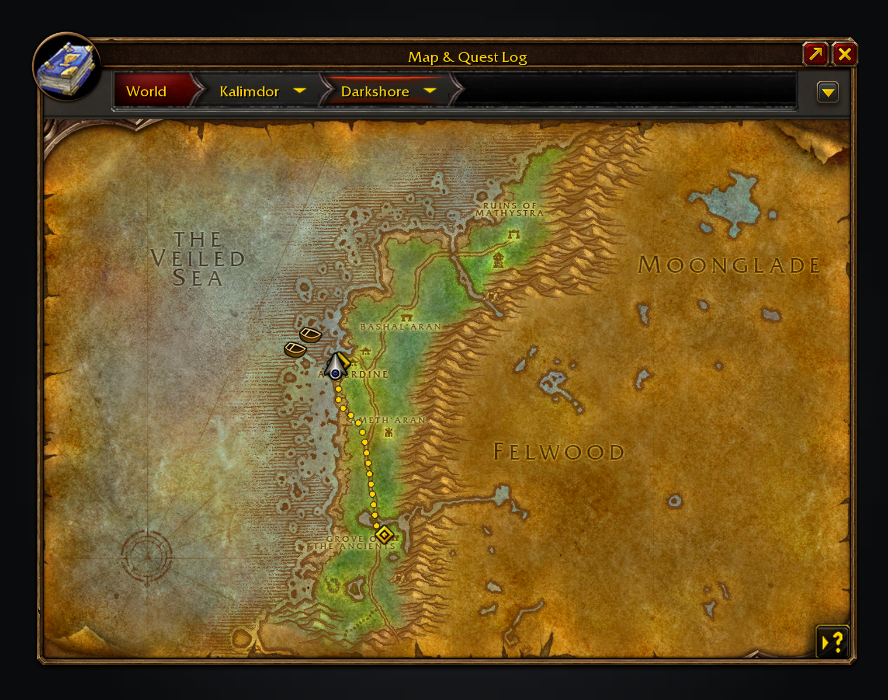

# Features in depth

The detail behind each feature in the [README](../README.md).

- **Journey planner.** Shift-click anywhere on the world map or minimap for the fastest way there from where you
  stand: walking, the flight points you know, boats and zeppelins with their live waits, lifts, the tram and
  portals, including a flight master you haven't found yet if walking to it pays off. Walks go through
  tunnels and between a city's levels, such as Dun Algaz and the Undercity, and walks keep out of water, which is slow and risky, unless you have Water Walking or Levitate (the step asks you to cast it). The route is drawn
  on the map and minimap, walking legs dotted, and the steps sit in the objective tracker like a tracked
  quest. It replans as you move but only switches to a clearly faster way (at least 30 seconds and a tenth of the time left), and stays aboard if you are already riding. **Guide**, on from the start
  of every journey (click the tracker header to turn it off), moves the game's own waypoint marker to where each step ends, the next boat, lift or flight master (or, with *Mark only where steps end* off in `/path`, along the route turn by turn, round walls), and hands your tracked quest back when you finish. To head for a quest, pick **Plan journey** from its right-click menu in the objective
  tracker or quest log, or Shift-click its marker on the map; a finished quest routes to its turn-in.
  A journey can start with your Hearthstone, a mage's city teleport (with a Rune of Teleportation), a shaman's
  Astral Recall or a druid's Teleport: Moonglade, after its own icon and named in your game's language:
  *1. Use Hearthstone*. A cooldown counts as waiting, and a jump to another continent adds a few seconds for
  the loading screen. The client does not say where your bind point is, so it is where you stood when you last
  bound at an innkeeper with the addon on; bound anywhere else since, the hearth is left out until you bind
  again. It is kept with the addon's saved settings, which the WoW: Forever client does not load yet, so after a
  `/reload` or relog the hearth is left out until you next bind. Class teleports need no bind point. Turn this
  off with *Use hearth and teleports* in `/path`.
  

  

- **Journeys from your guides.** While TomTom is not installed, the addon answers its waypoint calls, so Questie,
  Zygor and other guides that set a waypoint plan a journey here instead, titled with the guide's own text. Every
  waypoint belongs to one owner, so a fresh one replaces the journey rather than queueing; *Let guides set TomTom
  waypoints* off in `/path` removes the shim and clears the journey it started. A held stop can name the quests
  whose area it stands for: standing in one, the client draws its own quest blob in the bonus objective's gold on
  the minimap and on the world map, and the stop's pin and line step aside until you leave. Inside is the client's
  own inside-area state for the quests the stop names. A stop that names circles and no quest uses the circles to
  tell when you have arrived, and keeps its pin and line.

- **Finding the fastest way.** While a new journey is checked, the map shows only its destination pin and the
  tracker the Group Finder spinner; the route, steps and totals then appear together. A search that takes more than
  three seconds shows its best route so far, and changes it only for one at least 30 seconds and 10% faster, or if
  it stops working. The drawn route pulses gently on the world map and minimap while the spinner turns, then
  becomes steady as soon as the search finishes. Later checks run quietly without a spinner or pulsing.
  Nearby walks can settle immediately; longer searches stop as soon as no unchecked alternative can beat the chosen route. Only that route gets
  walking geometry, and drawn paths stay visible during refreshes, and clearing a journey releases its search caches. Walking
  maps load in small parts as the search reaches them, and a fixed walk on another continent keeps its measured cost
  and waits to draw its detailed line until you arrive there. Your position's costs refresh when you leave
  the path or once a minute. Repeating a destination reuses its costs; standing still or moving within the same
  walking-map cell by at most three yards also reuses your position's costs. Walk steps name the dock, pier, lift
  or flight master you are heading for.
  

  

- **A compass that looks like the game.** A slim strip at the top of the screen follows your facing and marks
  Guide's next two turns, the next stop and your destination, in the map's own parchment ticks and gold letters,
  fading out at each end, with your destination drawn as the game's own waypoint pin. On by default; *Show the
  compass* in `/path` turns it off.
  

- **Find nearby services.** Open the minimap's tracking menu or the world map's and pick *Nearby services*, or use
  `/spfnear`. It lists class and profession trainers, repairs, reagents, vendors, innkeepers, banks, auction houses, flight
  masters and stable masters. Pick a trainer or vendor specialty to route to the nearest friendly location in your
  installed QuestieDB.

- **Back to your corpse.** Release as a ghost and a red-orange dotted path, the colour of your corpse's tombstone,
  walks you back to it on the world map and minimap, round walls like any walk. Guide leads the way and the tracker
  reads *Return to your corpse* with the time and distance left. Your journey, or one another addon asks for while
  you are a ghost, waits and plans again from wherever you come back to life: at your corpse, at the spirit healer
  or from another player's resurrection. A corpse in another world map, such as a dungeon, gets no path. *Show the
  way to your corpse* in `/path` turns it off.

- **Docks on the world map.** Each pier gets the stock ferry icon and each zeppelin tower a matching
  zeppelin, on its zone and continent map. Hover one to see where each boat goes next, when it arrives and
  when it leaves; the docks it sails to light up. Docks too close to tell apart at the current zoom share
  one icon, and its tooltip names each pier by where it lies, and draws its routes on the map.
  Crossings between continents curve from dock to dock on the Azeroth map; closer maps show the sailing path.
- **On the minimap as well.** Docks, lifts, tram stations and portals appear on the minimap with the same icons
  and tooltips, and vanish at its rim like the game's own tracking icons. *Transport* in the minimap's tracking
  menu (or `/path`) turns them off.
  

- **Lifts, the Deeprun Tram and portals.** The Great Lift, Freewind Post, Thunder Bluff and Undercity
  lifts, and both tram trains, count down like the boats (each landing or station is its own stop). The
  tram shows at its Stormwind and Ironforge entrances. Portals are marked with where they go.
- **Flight masters on the world map**, known and undiscovered, with the game's own flight point icons.
- **In the map's filter menu.** *Flight Masters*, *Boat and Zeppelin Routes*, *Boats & Zeppelins*, *Lifts &
  Tram* and *Portals* turn each layer off; *Other Faction's Routes* shows the
  boats and zeppelins run by the other faction (anyone can ride them, but they are hidden by default).
- **The next departures in the objective tracker.** Walk up to a dock, lift or tram station and a section
  appears beside your quests, counting down to the next arrival and departure of everything that calls there.
  On board, it shows where the boat calls next and when it arrives.
- **A heads-up when your boat is due.** A raid-warning banner, a sound and a flashing taskbar icon, half a
  minute before a timed boat reaches your dock and just before your own boat docks, for anyone waiting AFK.
- **Times from real rides.** Each route's loop time comes from the game's own path data, so one ride tells
  the addon where that boat is for hours. Ride a boat, lift or tram once and its schedule syncs. Until then
  its dock says *no sighting yet*, and a journey counts half a loop as its wait, shown as *leaves in about 2:45*.
  A flight is timed from take-off to landing, and that time is preferred over the shipped estimate from then on. A
  flight's remaining time counts down from how far along the drawn route you are, so it holds steady on a slow or
  fast ride.
- **Shared between players.** Sightings are passed on quietly over guild, party and yell at the docks, so
  someone else's ride can time your boat. No chat messages are shown; turn it off in the settings.
